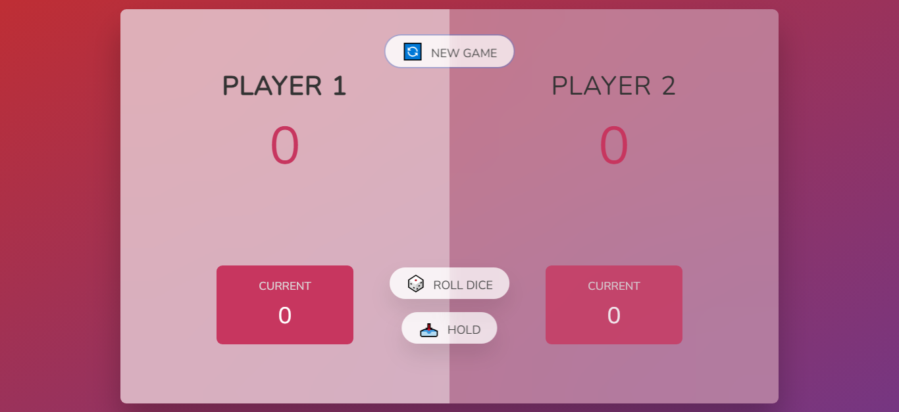
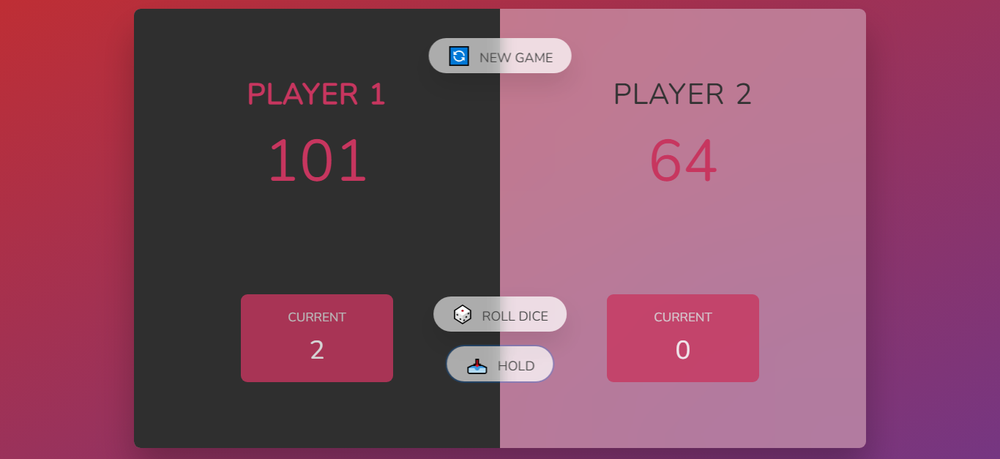

<div id="top"></div>


<!-- PROJECT LOGO  -->
<br />
<div align="center">
<a href="https://hold-n-roll.vercel.app/">
    
</a>

<h1>Hold-N-Roll</h1>

  <p align="center">
    <a href="https://hold-n-roll.vercel.app/">View Demo</a>
    ·
    <a href="https://github.com/SalahShallapy/Hold-N-Roll/issues">Report Bug</a>
  </p>
</div>

A fun two-player dice game built with HTML, CSS, and JavaScript. Players take turns rolling a dice, accumulating points, and competing to reach a score of 100 first. But beware: rolling a 1 will reset your turn's progress!

## Project Overview

### Overview



### Wrong Guess Overview



### Flowchart


## Features

- 🎲 **Dice Rolling**: Roll a dice to add points to your current score.
- 🔄 **Switch Players**: Rolling a 1 or holding your score switches the turn to the other player.
- 🏆 **Winning Condition**: The first player to reach 100 points wins!
- 📥 **Hold**: Secure your current score by holding.
- 🔄 **New Game**: Reset and start a new game anytime.

## Usage

1. Open the game in your browser by opening `index.html`.
2. Player 1 starts the game.
3. Click **"Roll Dice"** to roll the dice:
   - If the dice rolls a number other than 1, it adds to your current score.
   - If the dice rolls a 1, your turn ends, and your score for that round is lost.
4. Click **"Hold"** to add your current score to your total score and switch turns.
5. The first player to reach a score of 100 wins!
6. Click **"New Game"** to reset the game and start fresh.

## Project Structure

```
Hold-N-Roll
│      .prettierrc
│      README.md
│      index.html
│      style.css
│      script.js
│
└─── Images -----> all images
```

## Installation

To get started with the project locally:

1. Clone the repository:
   ```bash
   git clone https://github.com/SalahShallapy/Hold-N-Roll
   ```
2. Open the Project
   Navigate to the project folder and open the index.html file in your preferred web browser to start playing.

3. Requirements
   No additional dependencies are required. The game runs entirely in the browser using vanilla JavaScript, HTML, and CSS.

## Contributing

Contributions are what make the open source community such an amazing place to learn, inspire, and create. Any contributions you make are **greatly appreciated**.

If you have a suggestion that would make this better, please fork the repo and create a pull request. You can also simply open an issue with the tag "enhancement".
Don't forget to give the project a star! Thanks!

1. Fork the Project
2. Create your Feature Branch (`git checkout -b feature/AmazingFeature`)
3. Commit your Changes (`git commit -m 'Add some AmazingFeature'`)
4. Push to the Branch (`git push origin feature/AmazingFeature`)
5. Open a Pull Request

<p align="right">(<a href="#top">back to top</a>)</p>
